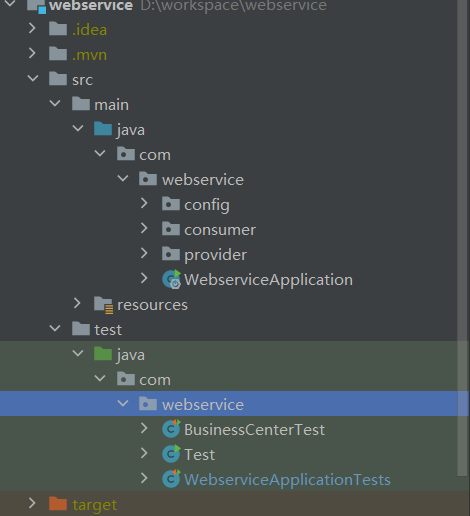
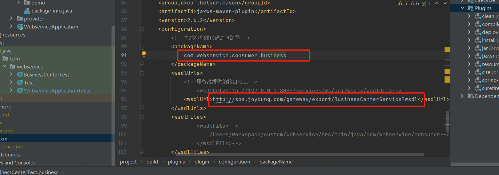
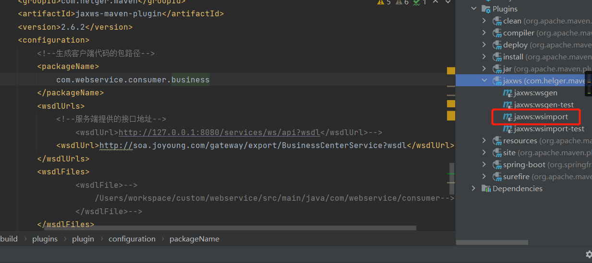
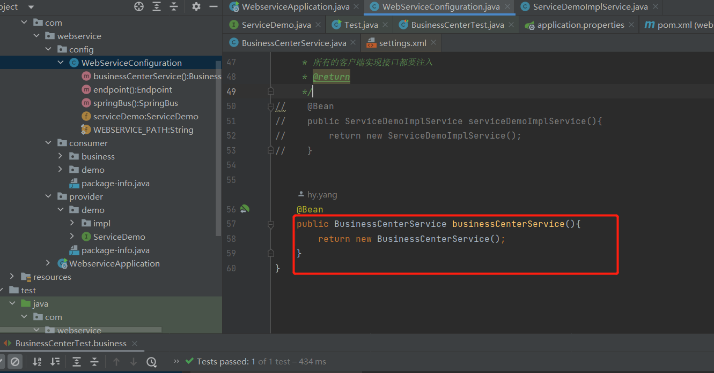
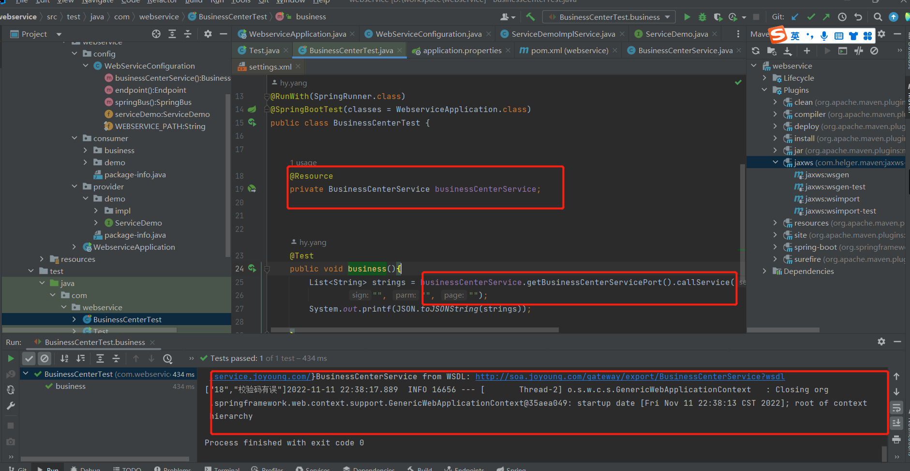
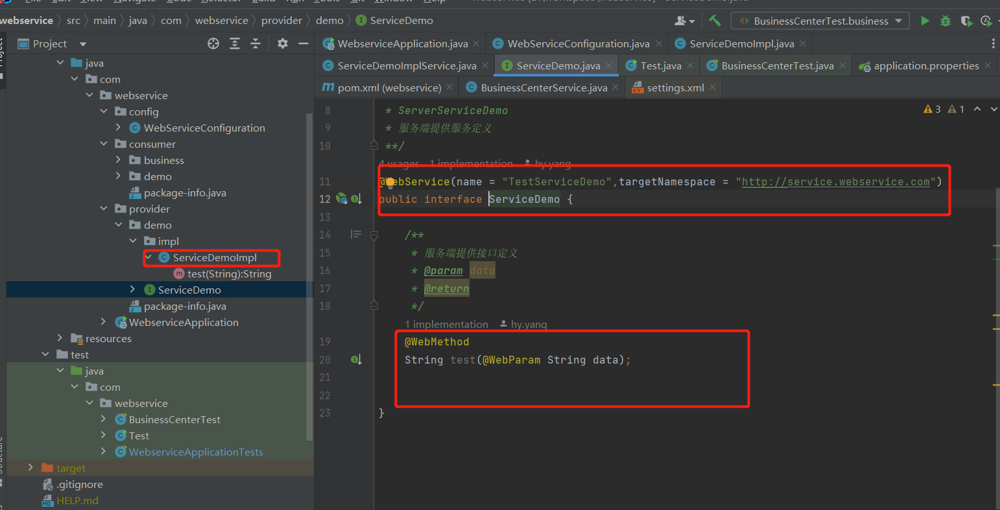

## **1 结构**

webservice

config  webservice相关配置

consumer  webservice客户端

provider  webservice服务端




## **2 新增客户端**

### **2.1 修改pom文件**



修改packageName 改为生成代码的包

修改wsdlUrl 服务端的地址

### **2.2 生成客户端代码**



点击生成客户端代码，结果可在packageName路径查看。


### **2.3 客户端接口注入spring容器**



也可以直接new出来，不建议。


### **2.4 单元测试**




## **3 新增服务端**

### **3.1 定义服务和接口及其实现**



已实现，可直接新增接口方法及实现即可。

也可以在当前包下新增服务端的类及其实现，但是要修改下配置类的（如下）

```java
    @Bean
    public Endpoint endpoint(){
        EndpointImpl endpoint = new EndpointImpl(springBus(), 修改为新增服务的bean);
        endpoint.publish(WEBSERVICE_PATH);
        return endpoint;
    }
```